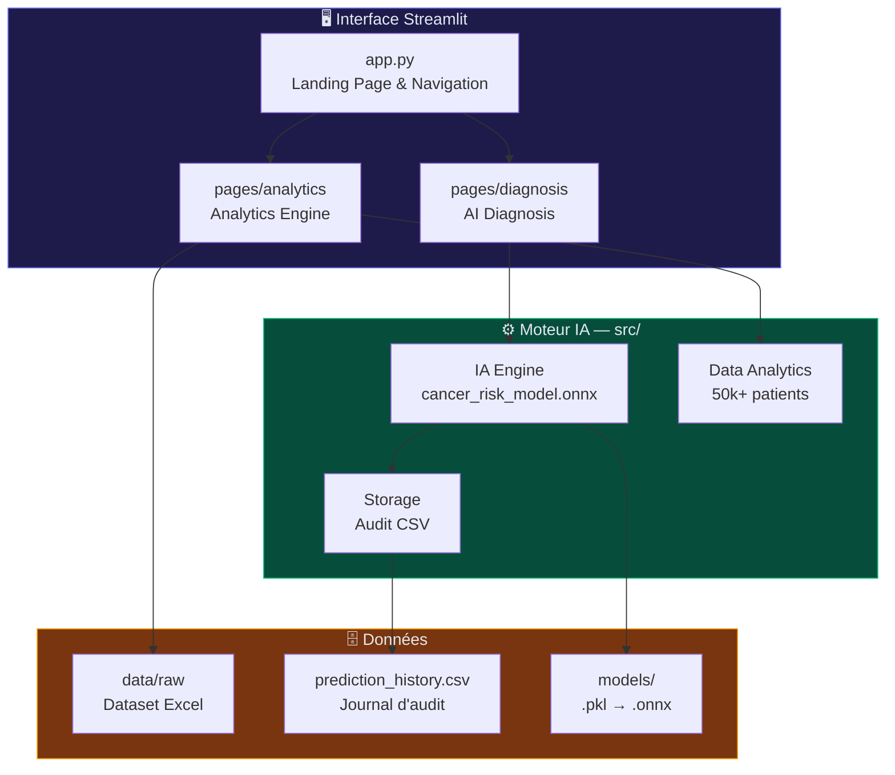
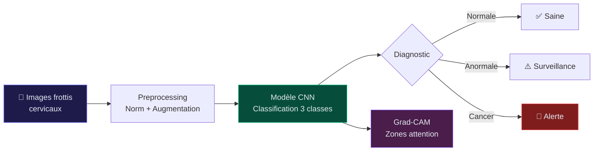
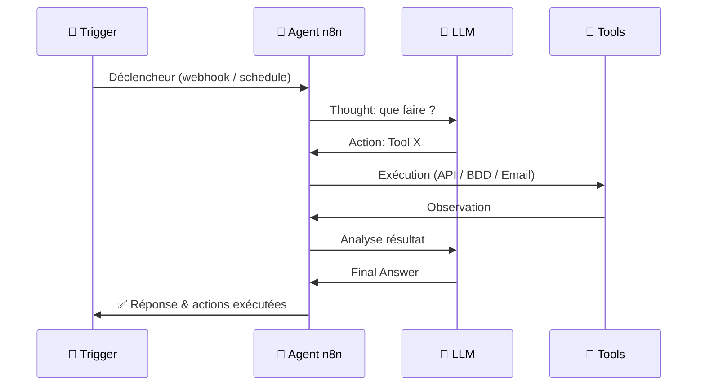
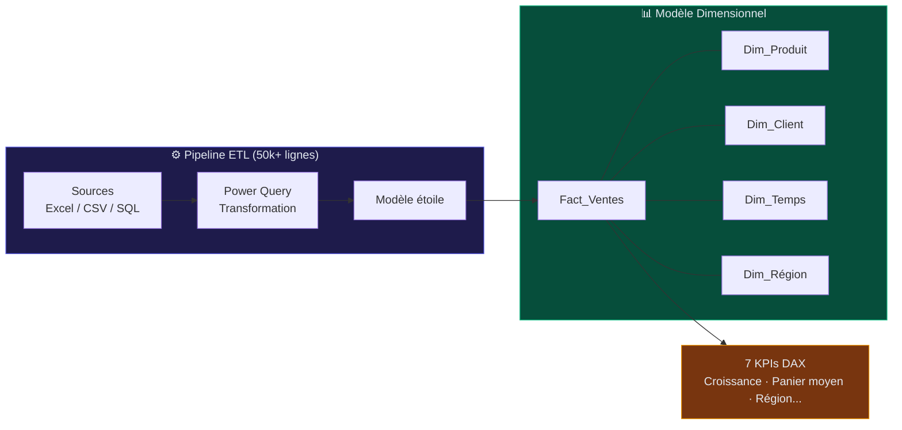
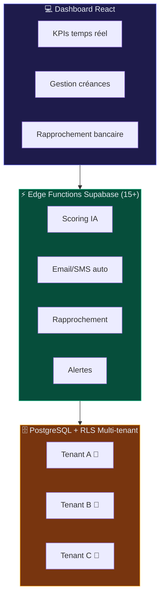
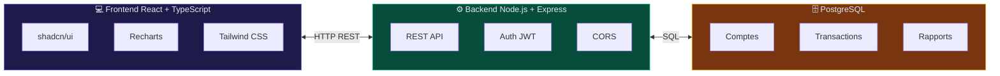
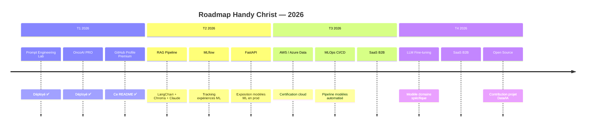

<div align="center">
  
</div>

<div align="center">

[](https://git.io/typing-svg)

<br/>

[](https://www.linkedin.com/in/handy-christ-peme-tsoka-797329272)
[](mailto:handytsoka89@gmail.com)
[](https://github.com/MonsterH-H/cv-handy-christ)
[](https://github.com/MonsterH-H/prompt-engineering-lab)

<br/>


</div>

---

## 🧠 Qui suis-je ?

```python
class HandyChrist:
    def __init__(self):
        self.nom          = "Handy Christ TSOKA PEME"
        self.role         = ["Data Engineer", "AI Developer", "Fullstack Dev", "SaaS Builder"]
        self.formation    = "4ème année Sciences des Données — ESTEM Casablanca"
        self.localisation = "Casablanca, Maroc 🇲🇦"
        self.disponible   = ["Stage PFE", "Alternance", "Freelance"]
        self.passion      = ["LLM / RAG / Agents IA", "ML & Computer Vision", "SaaS B2B Maroc"]
        self.langues      = {"Français": "C1 Avancé", "Anglais": "B2 Intermédiaire sup."}
        self.contact      = "handytsoka89@gmail.com"

    def philosophie(self) -> str:
        return "Chaque ligne de code doit avoir un impact mesurable sur le réel."

    def actuellement(self) -> list:
        return [
            "🔥 Construction de SaaS B2B pour le marché marocain",
            "🤖 Exploration RAG + agents IA multi-étapes",
            "📊 MLOps : déploiement de modèles en production",
            "☁️  Préparation certification AWS / Azure Data",
        ]
```

> Étudiant ingénieur passionné par la construction de solutions **data-driven** qui résolvent de vrais problèmes business. De l'exploration de données à la mise en production d'un SaaS complet — je couvre l'intégralité du pipeline : ML → API → Frontend → Deploy.

---

## 🛠️ Stack Technique

<div align="center">

### 🤖 IA · Machine Learning · LLM


### 💻 Développement Web & Mobile


### 🗄️ Data · Bases de données · DevOps


</div>

---

## 📊 GitHub Stats

<div align="center">
  
  
</div>

<div align="center">
  
</div>

<div align="center">
  
</div>

---

## 🏆 Trophées GitHub

<div align="center">
  
</div>

---

## 🚀 Projets — IA · Machine Learning · Computer Vision

### 🏥 [OncoAI PRO](https://cancerdetesction.streamlit.app) — Plateforme IA de Diagnostic Oncologique
> Plateforme clinique premium de prédiction du risque cancer — modèle ONNX, 23 paramètres cliniques, audit trail médical


Le cancer est évitable lorsqu'il est détecté tôt. **OncoAI PRO** est une plateforme d'aide au diagnostic oncologique de grade professionnel : elle combine machine learning, visualisations interactives et journalisation clinique rigoureuse pour assister les professionnels de santé.

**Architecture modulaire Enterprise Standard :**



**Fonctionnalités clés :**
- 🎯 **Inférence clinique** sur **23 paramètres** (âge, symptômes, facteurs environnementaux)
- 📊 **Analytics Engine** : statistiques réelles de cohorte + feature importance du modèle
- 🔍 **Interprétabilité** : visualisation des variables les plus prédictives
- 📋 **Audit Log** : chaque diagnostic sauvegardé automatiquement (traçabilité médicale)
- 📤 **Export CSV** : filtrage et export des données cliniques
- 🏗️ Structure modulaire `app.py` + `pages/` + `src/` + `models/` + `data/`

> ⚠️ *Outil d'aide à la décision médicale — les résultats doivent être interprétés par un professionnel de santé qualifié.*

🔗 **[cancerdetesction.streamlit.app](https://cancerdetesction.streamlit.app)** · 📁 **[github.com/MonsterH-H/Cancerdetesction](https://github.com/MonsterH-H/Cancerdetesction)**

---

### 🔬 [CerviScan-IA](https://github.com/MonsterH-H/CerviScan-IA) — Détection Cancer du Col de l'Utérus
> Deep learning CNN pour la classification automatique de cellules cervicales — aide au diagnostic précoce


**Pipeline ML complet :**



- 🤖 Classification 3 classes : normale / anormale / cancer
- 📊 Métriques médicales : précision, rappel, AUC-ROC, F1-score
- 📈 Grad-CAM : visualisation des zones de décision du modèle

---

### 👁️ [Reconnaissance Faciale](https://github.com/MonsterH-H/Reconnaissance_faciale) — Système Biométrique Temps Réel
> Détection et identification de visages en temps réel — Python + OpenCV + embeddings


- 📸 Détection temps réel via OpenCV + Haar Cascades / MTCNN
- 🧠 Embeddings faciaux pour identification robuste
- 🔐 Cas d'usage : contrôle d'accès, authentification biométrique

---

### 👁️ VisionO *(Private)* — SaaS Vision par Ordinateur
> API Python + Frontend TypeScript · détection, classification, segmentation temps réel


- 🔍 Modèles IA : détection objets, classification, segmentation
- 🌐 API REST Python → Interface TypeScript moderne · Docker

---

### 🤖 [Agent_n8n](https://github.com/MonsterH-H/Agent_n8n) — Agents IA Autonomes
> Workflows d'automatisation avec agents LLM sur n8n (Claude, GPT, Mistral)




---

### ⚗️ [Prompt Engineering Lab](https://github.com/MonsterH-H/prompt-engineering-lab) — Comparateur LLM Interactif
> Visualiser en temps réel l'impact de 6 techniques de prompt engineering via l'API Claude


| Technique | Principe | Impact |
|-----------|----------|--------|
| ⚡ Zero-Shot | Prompt direct sans exemple | Baseline référence |
| 📚 Few-Shot | 2-3 exemples fournis | Format cohérent |
| 🧠 Chain-of-Thought | Raisonnement explicite étape par étape | +qualité raisonnement |
| 🎭 Role Prompting | Rôle expert injecté dans le system | Spécialisation réponse |
| 📋 Structured Output | JSON strict forcé | Automation, parsing |
| 🔄 ReAct | Thought→Action→Observation | Agents, décision |

🔗 **[github.com/MonsterH-H/prompt-engineering-lab](https://github.com/MonsterH-H/prompt-engineering-lab)**

---

### 🛢️ [fleetopti_ml](https://github.com/MonsterH-H/fleetopti_ml) — ML Prédictif Flotte Véhicules
> Notebooks entraînement + export ONNX · **90% précision pannes** · **R² > 0.95** CO₂


---

### 🧪 [Business Intelligence](https://github.com/MonsterH-H/Business-Inteligence) — Dashboard Power BI
> ETL automatisé + modèle en étoile + 7 KPIs DAX pour analyse performance commerciale



---

### 🌿 [PétolaData](https://petoladata.streamlit.app) — Prédiction Production Pétrolière
> XAI avec SHAP · **82% précision** · 5 variables clés identifiées · déployé Streamlit


🔗 **[petoladata.streamlit.app](https://petoladata.streamlit.app)**

---

## 💼 Projets — SaaS & Applications Business

### 🏦 SmartCollect AI *(Private)* — Recouvrement Intelligent B2B
> SaaS Fullstack · Scoring IA prédictif · Multi-tenant RLS · 15+ Edge Functions




🔗 **[smartcollect.hesyd.com](https://smartcollect.hesyd.com)**

---

### 🏗️ [BuildingSense](https://buildingsense.vercel.app) — SaaS BTP Gestion Chantiers
> Plateforme tout-en-un pour piloter projets BTP, équipes et rentabilité · **500+ entreprises**


- 📊 Tableau de bord temps réel : **10K+ chantiers** · **99.9% uptime**
- 👥 Gestion d'équipes + planification intelligente IA
- 📁 Documents centralisés · **+25% rentabilité** clients
- 💰 Plans : Starter 49€/mois · Pro 149€/mois · Enterprise sur mesure

🔗 **[buildingsense.vercel.app](https://buildingsense.vercel.app)**

---

### 💰 financial-insight-hub *(Private)* — Gestion Comptable & Finance
> React + TypeScript + Node.js + PostgreSQL · dashboards financiers interactifs




- 📒 Journal comptable, grand livre, balance des comptes
- 📊 Dashboards Recharts interactifs : trésorerie, P&L, bilans
- 🔄 Rapprochement bancaire automatisé · Export PDF/Excel
- 🌗 Thème clair/sombre · Responsive · Auth JWT sécurisée

---

### 🚛 FleetOpti AI *(Private)* — SaaS Logistique Prédictif pour PME
> Spring Boot + TypeScript + ONNX + IoT · **90% précision** · **-25% coûts**


---

### 🏛️ HESYD *(Private)* — Écosystème Digital PME Maroc
> Automatisation IA + data pour accélérer les PME marocaines · TypeScript

---

### ⚖️ DECIDEX *(Public + Private)* — Aide à la Décision
> Workflow validation multi-niveaux · historique & traçabilité · TypeScript Full Stack

---

### 🤝 TenderAI *(Private)* — IA pour Appels d'Offres
> LLM pour analyser AO (PDF), extraire critères, générer réponses compétitives

---

### 📦 LOGI-SHARE *(Private)* — Logistique Collaborative Mobile
> App mobile LLM · mutualisation trajets/entrepôts PME · documents auto-générés

---

### 💸 [RELANCE](https://github.com/MonsterH-H/RELANCE) — Automatisation Recouvrement TPE/PME
> Relances progressives auto : rappel → mise en demeure → précontentieux

---

## 🎓 Projets Académiques & Gestion

### 🏫 SchoolGest — ERP Scolaire Java
> Spring Boot + Hibernate + Frontend HTML · gestion complète établissement scolaire

```mermaid
erDiagram
    ETUDIANT { int id PK; string nom; date inscription }
    COURS { int id PK; string matiere; int heures }
    ENSEIGNANT { int id PK; string nom; string specialite }
    NOTE { int id PK; float valeur; string semestre }
    ETUDIANT ||--o{ NOTE : obtient
    COURS ||--o{ NOTE : concerne
    ENSEIGNANT ||--o{ COURS : enseigne
```

### 🎓 [formationsGest](https://formationsgest.vercel.app) — ERP Centre de Formation
> Node.js + React + MongoDB · **-60% temps traitement** · 50+ étudiants
🔗 **[formationsgest.vercel.app](https://formationsgest.vercel.app)**

---

## 💼 Expériences Professionnelles

| Période | 💼 Poste | 🏢 Entreprise | ⚙️ Technologies | 📈 Impact |
|---------|---------|-------------|----------------|---------|
| Nov 2025 → Jan 2026 | **Développeur Full-Stack** | IP Technology, Casa | React 19, Express.js, MySQL, Drizzle, JWT/RBAC, LLM API, S3 | UX améliorée · Sécurité renforcée |
| Juil → Sept 2025 | **Stagiaire Dev Full-Stack** | Business IT Solutions (BITS) | Spring Boot, Angular, PostgreSQL, Agile/Scrum | E-Vignette Maroc en production |
| Juil → Sept 2024 | **Data Analyst Marketing** | YELTECH, Casablanca | Power BI, Odoo, Python, Web Scraping | **+20% conversion · -15% coûts** |

---

## 📈 Impact Chiffré

<div align="center">

| 🚀 Projet | 📊 Métrique | 🎯 Résultat |
|-----------|------------|-----------|
| FleetOpti AI | Précision prédiction pannes | **90%** |
| FleetOpti AI | Réduction coûts maintenance | **-25%** |
| FleetOpti AI | Score R² modèle CO₂ | **> 0.95** |
| OncoAI PRO | Paramètres cliniques analysés | **23** |
| PétolaData | Précision prédiction | **82%** |
| SmartCollect AI | Edge Functions production | **15+** |
| BuildingSense | Entreprises clientes | **500+** |
| BuildingSense | Gain rentabilité client | **+25%** |
| FormationGest | Réduction temps traitement | **-60%** |
| Business Intelligence | Lignes ETL traitées | **50 000+** |
| YELTECH | Taux de conversion | **+20%** |
| YELTECH | Réduction coûts marketing | **-15%** |

</div>

---

## 🌐 Applications Déployées en Production

<div align="center">

| 🔗 Application | 🏷️ Domaine | ⚙️ Stack | 🟢 Statut |
|---------------|----------|---------|---------|
| [smartcollect.hesyd.com](https://smartcollect.hesyd.com) | FinTech · Recouvrement | TypeScript + Supabase | 🟢 Live |
| [cancerdetesction.streamlit.app](https://cancerdetesction.streamlit.app) | Medical AI | Python + ONNX + Streamlit | 🟢 Live |
| [buildingsense.vercel.app](https://buildingsense.vercel.app) | BTP · SaaS | TypeScript + React + Vercel | 🟢 Live |
| [petoladata.streamlit.app](https://petoladata.streamlit.app) | Data Science · XAI | Python + SHAP + Streamlit | 🟢 Live |
| [formationsgest.vercel.app](https://formationsgest.vercel.app) | ERP · Formation | Node.js + React + MongoDB | 🟢 Live |

</div>

---

## 🗺️ Roadmap 2026



---

## 🌍 Langues

| Langue | Niveau | Contexte |
|--------|--------|----------|
| 🇫🇷 **Français** | C1 — Avancé | Travail quotidien, documentation, communication client |
| 🇬🇧 **Anglais** | B2 — Intermédiaire supérieur | Documentation technique, APIs, articles de recherche |

---

## 🎵 Centres d'intérêt

🎵 **Musique** · ⚽ **Football** · 📚 **Lecture** · 🤖 **Veille IA & Tech** · 🚀 **Entrepreneuriat**

---

<div align="center">

### 💬 *"Chaque ligne de code doit avoir un impact mesurable sur le réel."*

<br/>

[](https://www.linkedin.com/in/handy-christ-peme-tsoka-797329272)
[](mailto:handytsoka89@gmail.com)
[](https://github.com/MonsterH-H/cv-handy-christ)

<br/>


</div>
